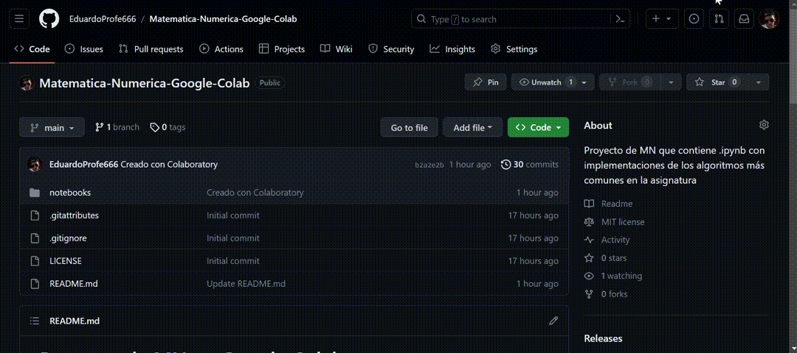
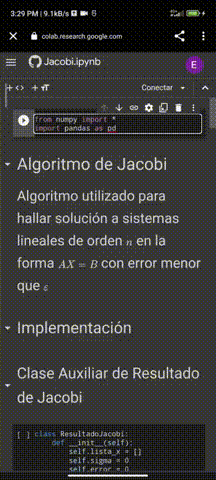

# Proyecto de MN en Google Colaboratory

> [!WARNING]
> El proyecto aún se encuentra en fase de desarrollo por lo que pueden existir errores y código incompleto

Proyecto que contiene una serie de jupyter notebooks con documentación sobre
los diferentes algoritmos a utilizar en la asignatura, su implementación en python,
y una sección para insertar los datos y obtener los resultados de cada algoritmo.

La forma de uso sugerida es a través de [Google Colaboratory](https://colab.research.google.com/?hl=es),
servicio en línea para la ejecución de código python de manera sencilla, rápida y segura, y sin la necesidad
de instalar nada, en cualquier plataforma: Windows, Linux, MacOs, Android y IOs.

También se puede emplear de forma local mediante `Jupyter Lab`.

## Directorio de enlaces de los notebooks a Google Colab

> [!NOTE]
> El directorio se encuentra ordenado por capítulos según el libro de texto de MN

- **Cap 1: Teoría de Errores**
  - [Medidas del Error](https://colab.research.google.com/github/LilyRosa/Matematica-Numerica-Google-Colab/blob/main/notebooks/cap1/Medidas_del_error.ipynb)
  - [Cifras significativas](https://colab.research.google.com/github/LilyRosa/Matematica-Numerica-Google-Colab/blob/main/notebooks/cap1/Cifras_Sig.ipynb)
  - [Cifras decimales](https://colab.research.google.com/github/LilyRosa/Matematica-Numerica-Google-Colab/blob/main/notebooks/cap1/Cifras_Dec.ipynb)
  - [Cifras exactas](https://colab.research.google.com/github/LilyRosa/Matematica-Numerica-Google-Colab/blob/main/notebooks/cap1/Cifras_Ex.ipynb)
- **Cap 2: Raíces de Ecuaciones Algebraicas**
  - **Separación de raíces**
    - [Método Gráfico](https://colab.research.google.com/github/LilyRosa/Matematica-Numerica-Google-Colab/blob/main/notebooks/cap2/separacion-raices/metodo-grafico.ipynb)
    - [Teorema de Bolzano-Cauchy](https://colab.research.google.com/github/LilyRosa/Matematica-Numerica-Google-Colab/blob/main/notebooks/cap2/separacion-raices/Bolzano-Cauchy.ipynb)
    - [Regla de Descartes](https://colab.research.google.com/github/LilyRosa/Matematica-Numerica-Google-Colab/blob/main/notebooks/cap2/separacion-raices/Descartes.ipynb)
    - [Fórmula de Lagrange](https://colab.research.google.com/github/LilyRosa/Matematica-Numerica-Google-Colab/blob/main/notebooks/cap2/separacion-raices/Lagrange.ipynb)
  - **Resolución de ecuaciones algebraicas**
    - [Método de Bisección](https://colab.research.google.com/github/LilyRosa/Matematica-Numerica-Google-Colab/blob/main/notebooks/cap2/resolucion-ecuaciones-algebraicas/Biseccion.ipynb)
    - [Método de Regula Falsi (Falsa Posición)](https://colab.research.google.com/github/LilyRosa/Matematica-Numerica-Google-Colab/blob/main/notebooks/cap2/resolucion-ecuaciones-algebraicas/Regula_falsi.ipynb)
    - [Método de Newton-Raphson](https://colab.research.google.com/github/LilyRosa/Matematica-Numerica-Google-Colab/blob/main/notebooks/cap2/resolucion-ecuaciones-algebraicas/Newton_Rhapson.ipynb)
    - [Método de Secantes](https://colab.research.google.com/github/LilyRosa/Matematica-Numerica-Google-Colab/blob/main/notebooks/cap2/resolucion-ecuaciones-algebraicas/Secantes.ipynb)
- **Cap 3: Sistemas de Ecuaciones Lineales y Matrices**
  - [Convertir matriz a la forma X = MX + C](https://colab.research.google.com/github/LilyRosa/Matematica-Numerica-Google-Colab/blob/main/notebooks/cap3/Conv-Matriz.ipynb)
  - [Matriz con diagonal predominante](https://colab.research.google.com/github/LilyRosa/Matematica-Numerica-Google-Colab/blob/main/notebooks/cap3/Diag-Predominante.ipynb)
  - [Método de Jacobi](https://colab.research.google.com/github/LilyRosa/Matematica-Numerica-Google-Colab/blob/main/notebooks/cap3/Jacobi.ipynb)
  - [Método de Gauss-Seidel](https://colab.research.google.com/github/LilyRosa/Matematica-Numerica-Google-Colab/blob/main/notebooks/cap3/Gauss-Seidel.ipynb)
- **Cap 4: Aproximación de Funciones**
  - [Método de LaGrange](https://colab.research.google.com/github/LilyRosa/Matematica-Numerica-Google-Colab/blob/main/notebooks/cap4/Lagrange.ipynb)
  - [Método de Newton](https://colab.research.google.com/github/LilyRosa/Matematica-Numerica-Google-Colab/blob/main/notebooks/cap4/Newton.ipynb)
- **Cap 5: Integración Numérica**
  - [Método de los Trapecios](https://colab.research.google.com/github/LilyRosa/Matematica-Numerica-Google-Colab/blob/main/notebooks/cap5/Trapecios.ipynb)
  - [Método de Simpson](https://colab.research.google.com/github/LilyRosa/Matematica-Numerica-Google-Colab/blob/main/notebooks/cap5/Simpson.ipynb)
- **Cap 6: Optimización Numérica**
  - **Sin restricciones**
    - [Búsqueda Secuencial Uniforme](https://colab.research.google.com/github/LilyRosa/Matematica-Numerica-Google-Colab/blob/main/notebooks/cap6/sin-restricciones/BSU.ipynb)
    - [Búsqueda Secuencial Acelerada](https://colab.research.google.com/github/LilyRosa/Matematica-Numerica-Google-Colab/blob/main/notebooks/cap6/sin-restricciones/BSA.ipynb)
  - **Con restricciones**
    - [Bisección](https://colab.research.google.com/github/LilyRosa/Matematica-Numerica-Google-Colab/blob/main/notebooks/cap6/con-restricciones/Biseccion.ipynb)
    - [Sección de Oro](https://colab.research.google.com/github/LilyRosa/Matematica-Numerica-Google-Colab/blob/main/notebooks/cap6/con-restricciones/Seccion-Dorada.ipynb)
- **Cap 7: Ecuaciones Diferenciales Ordinarias**
  - [Método de Euler](https://colab.research.google.com/github/LilyRosa/Matematica-Numerica-Google-Colab/blob/main/notebooks/cap7/Euler.ipynb)
  - [Método de Runge-Kutta 2 (RK2)](https://colab.research.google.com/github/LilyRosa/Matematica-Numerica-Google-Colab/blob/main/notebooks/cap7/RK2.ipynb)
  - [Método de Runge-Kutta 4 (RK4)](https://colab.research.google.com/github/LilyRosa/Matematica-Numerica-Google-Colab/blob/main/notebooks/cap7/RK4.ipynb)
- **Extras:**
  - [Playground](https://colab.research.google.com/github/LilyRosa/Matematica-Numerica-Google-Colab/blob/main/notebooks/extras/Playground.ipynb)
  - [Playground para graficar](https://colab.research.google.com/github/LilyRosa/Matematica-Numerica-Google-Colab/blob/main/notebooks/extras/Graficar.ipynb)
  - [Calculadora de Límites](https://colab.research.google.com/github/LilyRosa/Matematica-Numerica-Google-Colab/blob/main/notebooks/extras/Limites.ipynb)
  - [Calculadora de Derivadas](https://colab.research.google.com/github/LilyRosa/Matematica-Numerica-Google-Colab/blob/main/notebooks/extras/Derivadas.ipynb)
  - [Calculadora de Integrales](https://colab.research.google.com/github/LilyRosa/Matematica-Numerica-Google-Colab/blob/main/notebooks/extras/Integrales.ipynb)
- **Documentación de bibliotecas usadas:**
  - [Matrices (Arrays) en `NumPy`](https://colab.research.google.com/github/LilyRosa/Matematica-Numerica-Google-Colab/blob/main/notebooks/tutoriales-generales/Numpy%20Arrays.ipynb)
  - [Funciones en `NumPy`](https://colab.research.google.com/github/LilyRosa/Matematica-Numerica-Google-Colab/blob/main/notebooks/tutoriales-generales/Numpy%20Funciones.ipynb)
  - [Funciones en `SymPy`](https://colab.research.google.com/github/LilyRosa/Matematica-Numerica-Google-Colab/blob/main/notebooks/tutoriales-generales/Sympy%20Funciones.ipynb)
  - [Graficar en `SymPy`](https://colab.research.google.com/github/LilyRosa/Matematica-Numerica-Google-Colab/blob/main/notebooks/tutoriales-generales/Sympy%20Graficar.ipynb)
  - [Graficar en `MatPlotLib`](https://colab.research.google.com/github/LilyRosa/Matematica-Numerica-Google-Colab/blob/main/notebooks/tutoriales-generales/Matplotlib%20Graficar.ipynb)

## Modo de Uso

### Acceder a los notebooks en Google Colab

Para poder acceder a los notebooks en Colab se puede realizar:

- Explorando los archivos en el repositorio:

  > 

  > [!NOTE]
  > Una vez dentro del archivo `.ipynb` deseado, pruebe a cambiar el enlace de `github.com/...` a `githubtocolab.com/...`

- Utilizando el directorio de enlaces que se encuentra [en este Readme](#directorio-de-enlaces-de-los-notebooks-a-google-colab)

### Entorno de Desarrollo de Google Colab

Tips:

- Para la navegación organizada dentro del archivo se puede emplear el índice proporcionado por la página
- Para poder empezar a ejecutar el notebook se debe _conectar_ a un entorno de ejecución de Google Colab
- Cambiar los datos de entrada en las secciones de inserción de datos para poder obtener los resultados deseados
- Para ejecutar el nuevo código, ir a la pestaña `Entorno de ejecución` y seleccionar la opción `Reiniciar y ejecutar todo`, aceptando todas las ventanas emergentes
- Para poder ver los resultados dirigirse a la sección de salida de datos

#### Versión de Escritorio (Google Chrome)

> 

#### Versión Móvil (Google Chrome)

> 

### Acceder a los notebooks mediante Jupyter Lab

Para poder acceder a los notebooks en `Jupyter Lab` se deben realizar los siguientes pasos (`Windows`):

- [Descargar e instalar **python 3**](https://www.python.org/downloads/)

- [Descargar los notebooks de Github](https://github.com/LilyRosa/Matematica-Numerica-Google-Colab/archive/refs/heads/main.zip)

- Abrir la consola del sistema (`cmd`) en la localización de los notebooks (`shift+click derecho` -> `Abrir ventana de comandos aquí`)

- Instalar las [dependencias necesarias](#bibliotecas-empleadas) mediante `pip install` (Ej: `pip install numpy`), o usando el archivo `requirements.txt`
  incluido en este repositorio

- Lanzar sistema mediante el comando `jupyter lab`

### Entorno de Desarrollo de Jupyter Lab

> **Tutorial de Jupyter Lab**
>
> 

